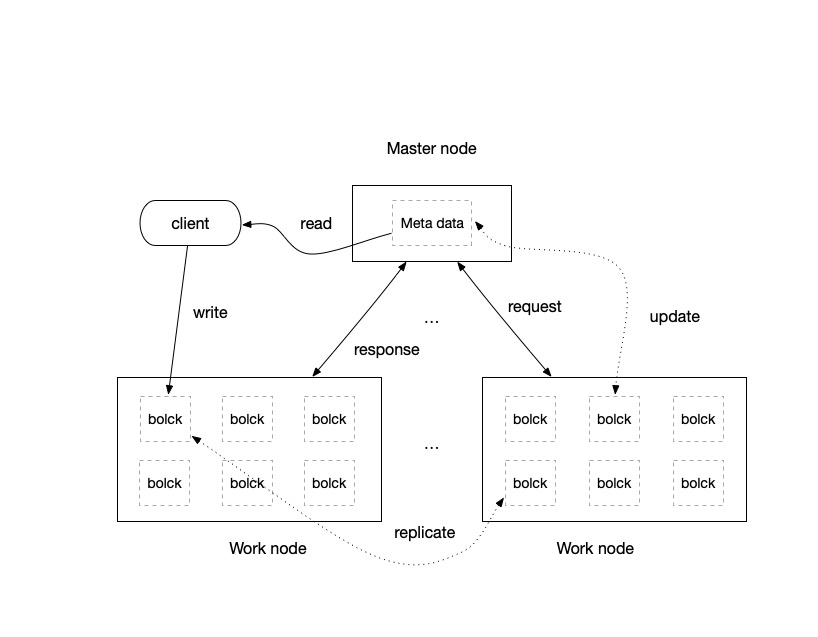

Simple Distributed File System
==========================
Simple Distributed File System是使用Java语言实现的，类似于Apache Hadoop HDFS的分布式文件系统，整体架构是如下所示。
 

### Master节点
Master是SDFS的主节点，存储整个文件系统的结构目录，以及各个存储文件的分块元数据信息

### Work节点
Work是SDFS的工作节点，主要用来做实际的文件存储工作

Quick Start
------------
待完善

整体项目目录结构如下
------------
```
SimpleDFS
├── README.md 
├── bin
│   └── start.sh
├── build.sh
├── conf
│   ├── master-config.xml
│   └── work-config.xml
├── logs
├── pom.xml
├── simple-dfs-client 
├── simple-dfs-core
├── simple-dfs-master
├── simple-dfs-work
```


